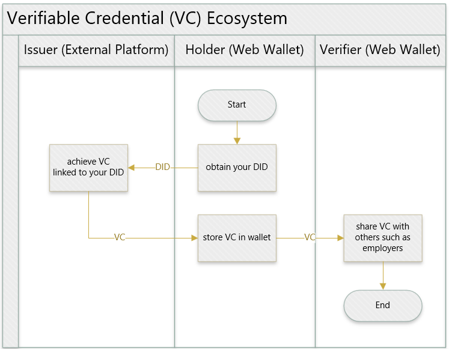

# Open VC Web Wallet

The Open Verifiable Credential (VC) Web Wallet ia an open-source ASP.NET Core web application used by VC Holders to store and share their credential online. The application can be hosted by anyone desirous of hosting a VC wallet online.

# What is a Verifiable Credential

Verifiable Credentials (VCs) are a type of digital credential issued to a holder to recognize their achievements. The VC is created based on the relevant World Wide Web Consortium [W3C Open Standards](https://www.w3.org/TR/vc-data-model-2.0/).

# Scope

This application will be used to store and share VCs that comply with the W3C standards and the 1EdTech [Open Badges V3 Specification](https://www.imsglobal.org/spec/ob/v3p0/).

# The VC Ecosystem

## Issuer Platform

A VC Issuer will use a software platform to issue a VC. The holder of the VC will be uniquely identified by a [Decentralized Identifier]() (DID). The holder DID can be created in the issuer platform or in a wallet application.

## Wallet Application

A wallet application is used by a holder to store and share their VCs. A web wallet is an application hosted online, usually with a cloud provider. The Open VC Web Wallet is such an application.

## Verifier

A holder will share their VCs in their wallet with verifiers such as employers. The verifier will usually use an application to verify that the VC is valid. The verification application may be part of the wallet, issuer platform or be an independent application.

